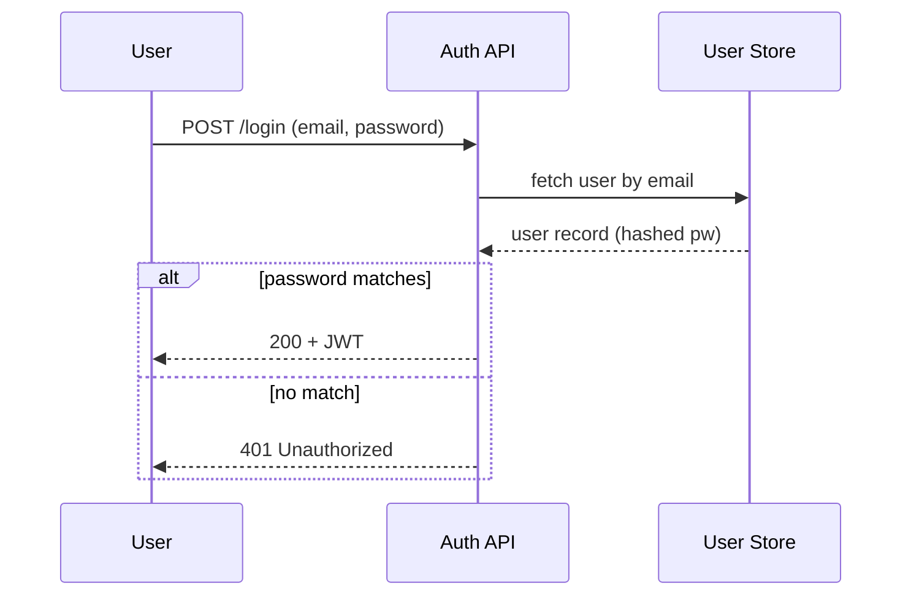
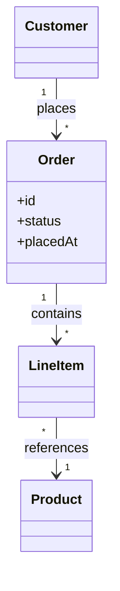
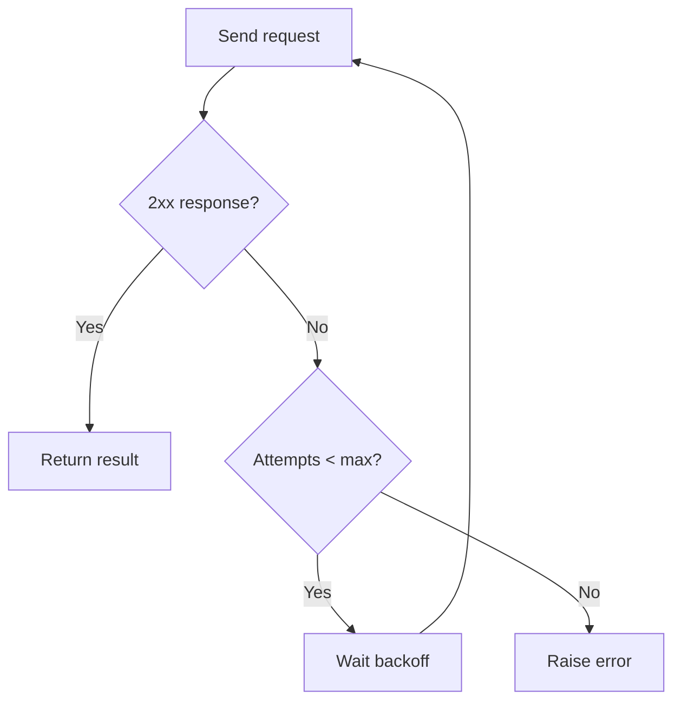

# Visualise

Produce a diagram that makes structure legible. Three diagram types cover almost everything; pick the one that matches what the user needs to understand, and produce more than one only when the subject genuinely has multiple dimensions (e.g. both an interaction flow and a data model).

Keep all in 1 file and include a short staement for each.

## Step 1 — Choose the diagram type

Match the type to the *question* the user is really asking:

| If the user needs to understand… | Use | Mermaid keyword |
|---|---|---|
| Who talks to whom, in what order, over time (API calls, message passing, request lifecycle) | **Sequence diagram** | `sequenceDiagram` |
| What the entities are and how they relate (data model, object model, schema) | **Domain model** | `classDiagram` or `erDiagram` |
| The path of control or a process (branching logic, decision trees, pipelines, algorithms) | **Flowchart** | `flowchart TD` |

If unsure which the user wants, ask one short question rather than guessing. If the request clearly spans two (e.g. "explain this service"), lead with the one that answers the primary question and offer the second.

## Step 2 — Extract the real structure first

Do not diagram surface syntax. Before writing any Mermaid, identify the actual participants/entities/steps from the source material (code, description, or docs). Read the code if it's available rather than inventing plausible-looking boxes. A diagram that's confidently wrong is worse than prose.

- **Sequence**: identify each actor/service/module as a participant. Capture the ordering, the direction of each call, return values that matter, and any loops/alternatives (`loop`, `alt`, `opt`).
- **Domain model**: identify entities, their key fields, and the relationships between them (association, composition, inheritance) with cardinality (1, `*`, `0..1`).
- **Flowchart**: identify start/end, each decision point (diamond) with its branch labels, and each action (rectangle). Keep one clear entry and mark terminal states.

## Step 3 — Output the diagram

Output the Mermaid in a fenced ```mermaid code block so it renders anywhere markdown does (Obsidian, GitHub, mermaid.live). Keep the diagram the focus and wrap it in one or two sentences of prose that say what it shows — never dump a diagram with no framing, and never stack diagrams back-to-back without text between them.

If the user explicitly asks for a file (".md", "save to…", "a file I can share"), write it: `write_architecture(area, name, content)` for system diagrams — it files them under `architecture/` in the repo — or `write_file` for a path they name explicitly.

## Quality bar

- **Legible over complete.** A diagram with 8 well-chosen nodes beats one with 40. If a system is large, diagram the one subsystem in question, or draw a high-level view and offer to zoom in.
- **Label every edge.** An unlabelled arrow forces the reader to guess. Sequence messages get verb phrases; flowchart branches get their condition (`Yes`/`No`, `valid`/`invalid`).
- **Direction is meaning.** Top-down for process flow, left-right only when it reads better. Consistent arrow direction.
- **Name things as the domain names them.** Use the real class/service/table names from the source, not generic "Component A".
- **State assumptions.** If you inferred a step the source didn't spell out, say so in the surrounding prose so the user can correct it.

## Examples

**Sequence diagram — user asks "how does the login flow work?"**


**Domain model — user asks "what are the entities in this ordering system?"**


**Flowchart — user asks "map out the retry logic"**

