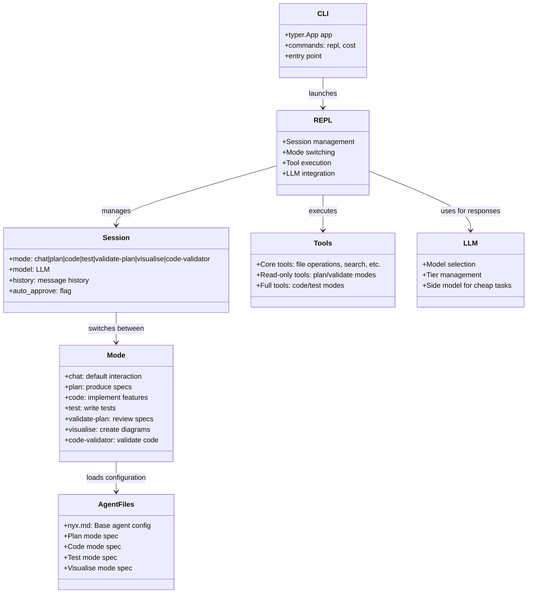

# Nyx Project Architecture

The architecture shows:
- CLI entry point that launches the REPL
- REPL manages sessions with different modes
- Session maintains state including mode, model, and history
- Modes define behavior specialization
- Tools are categorized based on mode permissions
- LLM handles the AI responses
- Agent files configure each mode's behavior